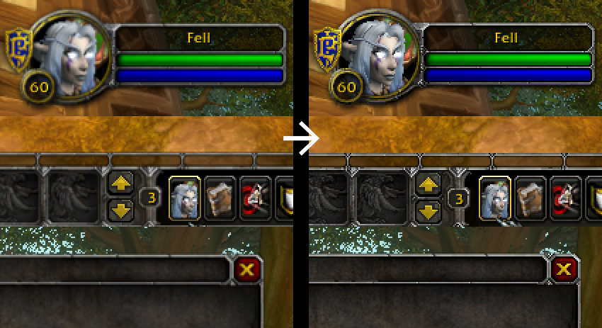

# Fell's Pixel Perfect Interface
Interface Addon for World of Warcraft 3.3.5a to improve sharpness of the default UI by pixel-aligning all elements.

## What it does

The UI elements of the stock interface in World of Warcraft 3.3.5a are blurred. Even when the correct UI scale is set, most elements are still positioned inbetween pixels causing the textures to appear less sharp than they actually are.

While this problem has been fixed in the Cataclysm expansion, this addon provides a workaround to replicate the fix in the Wrath Of The Lich King expansion

## How to install

1. [Download the latest Release](https://github.com/Fell/Fell_PixelPerfect/releases/download/1.0/Fell_PixelPerfect-1.0.zip).
2. Extract `Fell_PixelPerfect` into your `World of Warcraft\Interface\AddOns` folder.
3. That's it! No configuration needed. If you encounter issues, simply deactivate the addon on the character selection screen.

## How it works

1. This addon **deactivates the UI scale option**, and then applies the ideal scale based on the current resolution.
2. It then moves the entire UI by less than one pixel, such that all pixels of the interface exactly line up with the screen.
3. Lastly, it applies some 0.5 pixel offsets to elements which have not been fixed by the previous step.

## Details

The WoW interface has been designed for a resolution of 1024x768. The interface is automatically scaled at other resolutions. This can be changed through the UI scale setting, which applies a custom scale factor to the entire UI. When UI scale is equal to `768.0 / ScreenHeight`, all elements keep their true pixel size. You can learn more about this in [this thread](https://www.wowinterface.com/forums/showthread.php?t=55803).

At this ideal scale, you would expect the interface to be pixel perfect, but it is not. Even at exactly 1024x768 pixels, the textures are blurrier than their original files.

By trial and error, I fould out that the entire UI is offset by exactly (0.25, -0.4) pixels, causing all textures to be blurred. I don't really know where these numbers come from, but they seem to be correct at all resolutions. I assume it either has something to do with  the display on CRT monitors or it's a bug caused by Windows 10.

After applying an offset in the opposite direction (-0.25, 0.4) most of the interface looks crisp and clear, with the exeption of the main menu bar at the bottom. The game automatically centers it, placing it exactly inbetween pixels. I fixed this by shifting the affected elements manually until they looked sharp.
